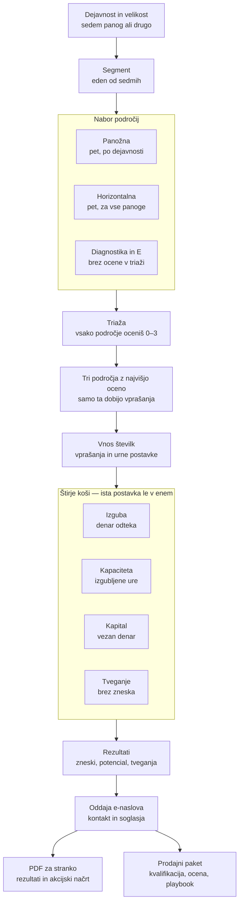

# LM-10 — Kalkulator "Koliko vas stane sedanji način dela?"

Interaktivni kalkulator skritih stroškov sedanjega načina dela. Obiskovalec vnese svoje številke in
takoj — še **pred** vnosom e-naslova — dobi razčlenjen letni izračun z razkrito metodologijo.

## Zagon

```bash
npm install
npm run dev
```

| Ukaz | Kaj naredi |
|---|---|
| `npm run dev` | razvojni strežnik |
| `npm run test` | unit testi formul in motorja |
| `npm run lint` | oxlint |
| `npm run typecheck` | `tsc -b` — vitest tipov NE preverja, zato je to svoj korak |
| `npm run build` | produkcijski build (typecheck + Vite) |

Iste štiri ukaze požene `.github/workflows/ci.yml` ob vsakem PR. Obstaja zato, ker je prej tekel samo
deploy ob potisku na `main`: napaka tipov se je pokazala šele ob objavi. Različica Node je v `.nvmrc`.

### Build spremenljivke

| Spremenljivka | Kaj naredi, če manjka |
|---|---|
| `VITE_LEAD_WEBHOOK_URL` | prodajna priprava se ne sestavi in lead nima poti do Datalaba (glej **Kaj se zgodi ob oddaji**) |
| `VITE_PUBLIC_URL` | `canonical`, `og:url` in `og:image` se ne izpišejo — napačen kanonični naslov je slabši od nobenega |

Obe se v objavi bereta iz repozitorijskih spremenljivk (`vars`) v `.github/workflows/deploy.yml`.
Predpona `VITE_` pomeni, da vrednost pristane v javnem svežnju — webhook se mora zato braniti sam
(omejevanje hitrosti, CORS, preverjanje izvora) in ne s skrivnostjo naslova.

Aplikacija se objavlja na podpot `/leadmagnetdl/` (`base` v `vite.config.ts`). Poti do datotek v `public/`
je zato treba sestaviti prek `import.meta.env.BASE_URL` — Vite prepiše samo poti v `index.html`, ne pa
tudi tistih v kodi ali v CSS `url()`.

## Segmenti

Segment ima **en sam vir: dejavnost, izbrano v prvem koraku.** Kampanjski `?s=` segmenta ne določi
mimo vprašalnika, ampak v Koraku 1 **prednastavi ustrezno dejavnost** — obiskovalec vidi, kaj je
povezava predpostavila, in jo sme popraviti. Podprt je tudi `?utm_source=` — vir se zapiše v izvozni
zapis.

Prej je obstajal še ročni override (zaslon "Izberite profil izračuna" in `?s=`), ki se ni počistil
nikoli: od prve nastavitve naprej je bil spustni seznam v Koraku 1 okrasen — obiskovalec je zamenjal
dejavnost, vprašalnik in rezultati pa so ostali na starem segmentu. Zaslona ni več; gumb v pasu na
koraku z vnosi ("spremeni dejavnost") vrne na Korak 1.

Ob spremembi dejavnosti se odgovori zavržejo samo, kadar se spremeni tudi **segment** — `trgovina` in
`drugo_blago` vodita v isti vprašalnik, zato bi brisanje pomenilo izgubo dela brez razloga.

| URL | Segment | Koraki |
|---|---|---|
| `?s=proizvodnja` | Proizvodnja 10–249 zap. | 7 |
| `?s=logistika` | Logistika in transport 10–249 zap. | 7 |
| `?s=trgovina` | Veleprodaja in distribucija | 7 |
| `?s=maloprodaja` | Maloprodaja | 7 |
| `?s=storitve` | Storitve in projekti 10–249 zap. | 7 |
| `?s=racunovodstvo` | Računovodski servis | 7 |
| `?s=splosno` | Direktor / CFO | 7 |

## Tok

```
dejavnost → zaposleni → [kontekst] → [triaža] → [stroškovni predpostavki] → vnosi → rezultat → e-naslov
```



Dve zakonitosti, ki ju diagram pokaže, iz kode pa nista očitni. Prva: **panoga ni os razvejanja —
segment je.** Dejavnost se enkrat preslika v segment, vse naprej se ravna po njem. Druga: **triaža je
razlog, da vprašalnik ni daljši**, čeprav ponudi 7–10 področij — poglobljena vprašanja dobijo le tri z
najvišjo oceno, torej tista, ki obiskovalca dejansko bolijo.

Dejavnost in število zaposlenih sta ločena koraka: iz dejavnosti se izpelje segment in s tem celoten
nadaljnji vprašalnik, število zaposlenih pa v nobeno formulo ne vstopi — uporabi se samo za velikostni
razred v poročilu.

Koraka v oglatih oklepajih vklopi **vnos dejavnosti v `src/config/contexts/`** — konfiguracija je hkrati
stikalo, zato zastavice brez konfiguracije (ki bi prikazala prazen korak) ni več. Triažo vklopi
`triage: { recommendedCount }` v `src/config/segments.ts`. Zaporedje in številčenje korakov se izpeljeta iz
tega, zato dodajanje koraka ne pomeni urejanja verige pogojev.

Kontekst določa tudi besedila: "Kako pretežno proizvajate?" prevozniku ne pomeni ničesar, zato ima vsaka
dejavnost svoja vprašanja, svoje možnosti sistema (in s tem pasove izboljšave) ter svoje razpone urnih
postavk — voznikova ura ni operaterjeva. Od kod so številke v teh razponih, pove
[`docs/urne-postavke.md`](docs/urne-postavke.md): izpeljane so iz plač po poklicih v zasebnem sektorju
(SURS, strukturna statistika plač, oktober 2025) in preverjene proti izmerjenemu strošku dela iz nacionalnih
računov — ne ocenjene.

## Moduli

Moduli so **podatki**, ne koda: vsak modul v `src/config/modules/` sam pove, kaj vpraša, kako računa in v
kateri koš gre izid. Dodajanje dejavnosti = nova datoteka z definicijami + vpis v register.

Vsak segment ponudi **pet panožnih področij** (spodaj po dejavnostih) in poleg njih **dve do pet
horizontalnih**, ki jih ima vsako podjetje ne glede na panogo — glej **Horizontalna področja** za
seznam in matriko vključitve.

### Proizvodnja — pet izključujočih se stroškovnih področij

| Modul | Meri |
|---|---|
| `planiranje` | Plan, kapacitete in navodila |
| `material` | Izmet, dodelave in kakovost |
| `zaloge` | Zaloge in razpoložljivost materiala |
| `nalogi` | Delovni nalogi in podatki |
| `zamude` | Roki in nujni stroški |
| `diagnostika` | Štiri vprašanja o podatkih in odpornosti procesa — brez evrov, vedno vidna |
| `E` | Tehnična opozorila (SQL Server, Windows Server, ZIERDED) — **samo obstoječim uporabnikom PANTHEON** |

Triaža predizbere tri področja in **ničesar ne omejuje** — obiskovalec sme obkljukati vsa.
`recommendedCount` pove, koliko jih je privzeto označenih in koliko jih priporočamo; neobvezni
`defaultIds` pa, **katera** so to. Ta seznam je ločen od `moduleIds` namenoma: tisti vrstni red
določa prikaz v razčlenitvi, grafu in PDF-ju ter razrešuje izenačenje pri "največji postavki", zato
privzete izbire ni mogoče popraviti prek njega, ne da bi se premaknili rezultati. Brez `defaultIds`
veljajo prva področja po `moduleIds`.

Področje, ki ga obiskovalec izbere in pusti prazno, prispeva 0 EUR, zato ne šteje ne v oceno
zanesljivosti ne med izmerjena — pokaže se po imenu v razdelku "Česa nismo izmerili". Brez tega bi
ista številka dobila slabšo oznako samo zato, ker je obiskovalec obkljukal več področij.

### Logistika in transport — pet izključujočih se stroškovnih področij

Zgrajena po istem vzorcu (`src/config/modules/logistika.ts`), z isto disciplino košev in naslovljivih
deležev. Vsako področje ima vsaj eno vprašanje, ki sme ostati 0: špediter brez vozil vpiše 0 praznih
kilometrov, skladiščnik tujega blaga 0 vrednosti zaloge — in izračun kljub temu ostane smiseln.

| Modul | Meri |
|---|---|
| `odprema` | Planiranje prevozov in izkoriščenost (prazni km, čakanje, razporejanje) |
| `napake` | Napačne dostave, poškodbe in reklamacije |
| `skladisce` | Skladiščne operacije in zaloga (iskanje, popisne razlike, vezan kapital) |
| `dokumentacija` | Prevozna dokumentacija in podatki (CMR, POD, prepisovanje) |
| `roki` | Zamude, stojnine in nujni prevozi |
| `diagnostika_logistika` | Štiri vprašanja o podatkih in odpornosti procesa — brez evrov, vedno vidna |
| `E` | Kot pri proizvodnji — samo obstoječim uporabnikom PANTHEON |

Meje med področji so zapisane v besedilih `help`, ker jih upošteva samo obiskovalec: čakanje na rampi je
`odprema`, iskanje v skladišču `skladisce`; reklamacija zaradi poškodbe je `napake`, obveščanje o zamudi
`roki`; stojnina, ki jo plačate vi, je strošek, tista, ki jo zaračunate, pa ni.

### Veleprodaja in distribucija — pet izključujočih se stroškovnih področij

Področja sledijo poti blaga in denarja, zato je meja med njimi **časovna in ne tematska** — to je edini
način, da si veleprodajalec ob vsakem vprašanju zna odgovoriti, ali "to sodi sem".

| Modul | Meri |
|---|---|
| `narocila_trgovina` | Naročila, ponudbe in cene (vnos, prepisovanje, izgubljena marža) |
| `skladisce_trgovina` | Skladišče in komisioniranje (iskanje, prevzemi, inventure, nadure) |
| `zaloge_trgovina` | Zaloge, nekurantnost in izpad prodaje (odpisi, izgubljena marža, vezan kapital) |
| `odprema_trgovina` | Odprema, vračila in reklamacije (ponovne dostave, dobropisi, vračila) |
| `terjatve_trgovina` | Plačilni roki in terjatve (zamude, opominjanje, odpisi) |
| `diagnostika_trgovina` | Štiri vprašanja o podatkih in odpornosti procesa — brez evrov, vedno vidna |
| `E` | Kot pri proizvodnji — samo obstoječim uporabnikom PANTHEON |

Dvoje je vredno vedeti pred urejanjem:

- **Fizično ponovno komisioniranje napačne pošiljke se namenoma ne šteje nikjer.** V `skladisce_trgovina`
  ne sodi, ker je posledica napake pri odpremi; v `odprema_trgovina` ne, ker se tam ure vrednotijo po
  administrativni postavki za pisarniško reševanje reklamacije. Podštevanje je boljše od dvojnega štetja.
- **`terjatve_trgovina` šteje samo prekoračitev NAD dogovorjenim rokom, ne celotnega DSO.** Financiranje
  roka, ki ste ga kupcu sami odobrili, je normalno poslovanje. Celoten DSO bi dal večjo številko, ki bi
  jo vsak finančnik takoj zavrnil. Letni strošek kapitala je konstanta `RECEIVABLES_CAPITAL_COST`
  (`src/config/modules/shared.ts`), ne vprašanje — omejitev na šest polj na modul je ostrejša od koristi.

### Maloprodaja — šest izključujočih se stroškovnih področij

| Modul | Meri |
|---|---|
| `razpolozljivostMp` | Prazne police in nedobavljivi artikli |
| `zalogeMp` | Presežna zaloga, odpisi in znižanja |
| `marzeMp` | Cene, akcije in marža |
| `blagajnaMp` | Blagajna, zaključki in manko |
| `prevzemMp` | Prevzem blaga, dokumenti in prenosi |
| `kanaliMp` | Spletna prodaja in usklajenost kanalov |
| `diagnostikaMp` | Štiri vprašanja o podatkih in odpornosti procesa — brez evrov, vedno vidna |

Najostrejša meja v maloprodaji je med **znano in neznano** izgubo blaga: odpisano, poteklo in prisilno
znižano blago je `zalogeMp` (vemo, kaj se je zgodilo), inventurni manko pa `blagajnaMp` (ne vemo). Trgovec
obe številki pozna ločeno; v enem znesku bi bila razlika izgubljena, z njo pa vsak ukrep, ki iz nje sledi.

### Storitve in projekti — pet izključujočih se stroškovnih področij

Edina dejavnost, ki poleg dveh stroškovnih ur vpraša tudi **zaračunano urno postavko**. Razlog je v naravi
izgube: proizvodnja izgublja material, storitveno podjetje pa opravljene ure, ki nikoli ne pridejo na
račun. Ta ura ni izgubljena kapaciteta, ampak izgubljen prihodek, zato se vrednoti po ceni in ne po
strošku.

| Modul | Meri |
|---|---|
| `projekti_storitve` | Plan, prioritete in zasedenost ekipe |
| `obracun_storitve` | Evidenca dela in zaračunavanje (nezaračunane ure, dobropisi) |
| `obseg_storitve` | Obseg, spremembe in dodelave |
| `administracija_storitve` | Projektna administracija in podatki |
| `terjatve_storitve` | Roki, plačila in vezan denar (vključno s kapitalom v nezaračunanem delu) |
| `diagnostika_storitve` | Štiri vprašanja o podatkih in odpornosti procesa — brez evrov, vedno vidna |
| `E` | Kot pri proizvodnji — samo obstoječim uporabnikom PANTHEON |

Najostrejša meja v tej dejavnosti je med **zaračunano in interno uro**, ker je edina, kjer isti podatek
lahko pristane v dveh koših hkrati:

- opravljena za naročnika, a ni prišla na račun → `obracun_storitve`, koš `directLoss`, po **zaračunani**
  postavki;
- interna, presežena ali administrativna → `projekti_storitve` / `obseg_storitve` /
  `administracija_storitve`, koš `capacity`, po **strošku** ure.

Nikoli oboje. Pravilo je zapisano v besedilih `help`, varuje pa ga test v
`src/config/modules/storitve.test.ts`: dvig zaračunane postavke sme premakniti natanko eno postavko v
celotni dejavnosti. Zato tudi nezaračunane ure namenoma nimajo `hoursPerMonth` — koš `directLoss` meri
denar, ne sproščene kapacitete.

### Računovodski servis — pet izključujočih se stroškovnih področij

Edina dejavnost, ki **nima koša `oneTimeCapital`**: servis ne drži zaloge in si zato ne more sprostiti
obratnega kapitala. Vsiljena postavka bi bila prazna številka, ki bi na zaslonu delovala kot prihranek.
Zato je težišče v košu `capacity` — zaloga servisa je čas ekipe, njegov material pa listina, ki jo
prinese nekdo drug.

| Modul | Meri |
|---|---|
| `zajemRs` | Zajem in vnos listin (ročni vnos, prepisovanje med programi, arhiviranje) |
| `strankeRs` | Listine strank in komunikacija (lovljenje listin, ponavljajoča se vprašanja) |
| `obracuniRs` | Obračuni, roki in konice (nadure, zunanja pomoč, globe zaradi zamude) |
| `popravkiRs` | Napake in popravki (popravljanje knjižb, kontrole, samoprijave, dobropisi) |
| `donosnostRs` | Neobračunano delo in donosnost strank |
| `diagnostikaRs` | Štiri vprašanja o podatkih in odpornosti procesa — brez evrov, vedno vidna |
| `E` | Kot pri proizvodnji — samo obstoječim uporabnikom PANTHEON |

Dve meji sta ostrejši kot drugod:

- **Zamuda proti napačni vsebini.** Globe in obresti zaradi *prepozne oddaje* so `obracuniRs`, doplačila
  in samoprijave zaradi *napačne vsebine* pa `popravkiRs`. Obe sta za obiskovalca „kazen od FURS-a", zato
  vprašanji druga drugo izrecno izključita v besedilu `help`.
- **Računovodska proti vodstveni uri.** Nista zamenljivi: referent lovi listine in popravlja knjižbe,
  vodja odgovarja strankam in podpiše obračun. Podpis pod obračun nosi odgovornost, ki je referent ne more
  prevzeti, zato ima ta ura svojo postavko. Test v `src/config/modules/racunovodstvo.test.ts` drži, katera
  postavka pripada kateremu izidu.

Za razliko od storitev se **neobračunana ura vrednoti po strošku, ne po ceniku** (koš `capacity`).
Izračun namenoma ne trdi, da bi stranka to uro plačala, če bi jo servis zaračunal; hkrati je to prav
tista ura, ki napaja naslov segmenta — „+X strank brez nove zaposlitve". Delitelj ni skrita konstanta:
povprečne ure na stranko vpraša `donosnostRs`, `segments.ts` pa hrani le rezervo za primer, ko tega
področja obiskovalec v triaži ne izbere. Da nobeno področje ne uporabi zaračunane postavke, varuje
poseben test.

### Splošno — pet področij, ki jih ima vsako podjetje

Sem pride le obiskovalec, ki je izbral „Drugo" in nato zavrnil vse štiri ponujene poslovne modele (glej
**Kategorija „drugo"** spodaj). Vprašanja zato kot edina v kalkulatorju **ne smejo predpostaviti, kaj
podjetje počne** — izmet, prazni kilometri in nezaračunane ure bi merili nekaj, česar nima.

| Modul | Meri |
|---|---|
| `podatkiSp` | Ročno delo s podatki in dokumenti (vnašanje, popravljanje, priprava poročil) |
| `usklajevanjeSp` | Iskanje informacij in usklajevanje (zastoji, iskanje, statusna vprašanja) |
| `napakeSp` | Napake in ponovno delo (popravljanje, reklamacije, izgubljena marža) |
| `denarSp` | Plačilni roki in terjatve (zamude, izterjava, odpisi) |
| `zalogeSp` | Zaloge in vezan kapital (odpisi, sprostljiv kapital) |
| `diagnostikaSp` | Štiri vprašanja o podatkih in odpornosti procesa — brez evrov, vedno vidna |
| `E` | Kot pri proizvodnji — samo obstoječim uporabnikom PANTHEON |

Kjer področje za podjetje ne velja (holding brez zalog), ga **reši triaža**: obiskovalec ga oceni z 0 in
se sploh ne vpraša. Vnaprejšnje ugibanje, katero področje je relevantno, zato ni potrebno — zato sta
privzeto obkljukani `podatkiSp` in `usklajevanjeSp`, edini dve, ki ju ima res vsako podjetje
(`triage.defaultIds`).

Cena univerzalnosti ni skrita v izračunu, ampak v **pasovih izboljšave**: ti so za ta segment ožji
(8–18 % do 20–35 % namesto 25–40 %), ker univerzalna vprašanja strošek zajamejo manj natančno.

### Horizontalna področja — ista definicija v več segmentih

Panožni moduli merijo samo bolečino osnovne dejavnosti. Proizvodno podjetje pa poročila sestavlja,
plače obračunava in dokumente potrjuje enako kot vsako drugo — in prav to so področja, ki jih
PANTHEON pokriva, vprašalnik pa jih prej ni znal zaznati. Zato so definirana **enkrat** v
`src/config/modules/horizontal.ts` in vključena v več segmentov hkrati (isti vzorec kot skupni
modul `E`).

| Modul | Meri |
|---|---|
| `analitikaHz` | Analitika in poročanje (priprava poročil, izredne analize, združevanje podatkov) |
| `financeHz` | Računovodstvo in finance (knjiženje, usklajevanje, obračuni, globe in obresti) |
| `kadriHz` | Kadri in plače (evidence ur, priprava obračuna, kadrovska administracija) |
| `dokumentiHz` | Dokumentacija in e-poslovanje (potrjevanje, iskanje, tiskanje in ročno pošiljanje) |
| `servisHz` | Reklamacije in poprodajni servis (garancijska popravila, vodenje postopka in RMA, nadomestni deli) |

Obravnava je enaka panožni: triažno vprašanje, pet vprašanj, izračun v evrih, lastne alineje
„PANTHEON naslavlja". Horizontala je torej lahko tudi **največja postavka** in s tem izhodišče
akcijskega načrta.

| Segment | `analitikaHz` | `financeHz` | `kadriHz` | `dokumentiHz` | `servisHz` | Triažnih vprašanj |
|---|:---:|:---:|:---:|:---:|:---:|:---:|
| Proizvodnja | ✓ | ✓ | ✓ | ✓ | ✓ | 10 |
| Veleprodaja in distribucija | ✓ | ✓ | ✓ | ✓ | ✓ | 10 |
| Maloprodaja | ✓ | ✓ | ✓ | ✓ | ✓ | 10 |
| Storitve in projekti | ✓ | ✓ | ✓ | ✓ | ✓ | 10 |
| Logistika in transport | ✓ | ✓ | ✓ | — | — | 8 |
| Računovodski servis | ✓ | — | ✓ | — | — | 7 |
| Splošno | — | ✓ | ✓ | ✓ | — | 8 |

Izključitve niso okus, ampak **zaščita pred dvojnim štetjem ur**: računovodski servis nima
`financeHz`, ker so knjiženje in obračuni njegov produkt (merijo jih `zajemRs`, `obracuniRs`,
`popravkiRs`), in nima `dokumentiHz`, ker zajem listin meri `zajemRs`; logistika nima `dokumentiHz`,
ker isto merijo prevozne listine v `dokumentacija`; splošni segment nima `analitikaHz`, ker ure
poročanja že šteje `podatkiSp`. Kjer se področji le dotikata, razmejitev opravi napotek pod
vprašanjem („Ure, ki ste jih že vpisali v drugem področju, tu ne ponavljajte.").

`servisHz` je poseben primer iste logike. Stroške reklamacij v evrih (dobropisi, vračila, poškodovano
blago) in ure njihovega reševanja **že merijo panožni moduli v šestih od sedmih segmentov**, zato
modul meri izrecno le tisto, česar ne meri nihče: servis in garancije **po predaji**, vodenje
reklamacijskega postopka ter nadomestne dele in zunanji servis. Zato ga ni v logistiki (`napake` že
meri reklamacijske ure in stroške napačnih dostav), v računovodskem servisu (lastne napake meri
`popravkiRs`) niti v splošnem segmentu (`napakeSp` že meri ponovno delo in reklamacije). Je tudi
edina horizontala z **dvema urnima postavkama**: servisni poseg opravi izvajalec, zato gre po
neposredni uri, vodenje postopka pa je pisarniško delo po administrativni.

`kadriHz` je pri računovodskem servisu vključen namenoma: meri **njegove lastne** kadre in plače, ne
obračunov, ki jih dela za stranke.

V `moduleIds` so horizontale vedno **za panožnimi in pred diagnostiko**. Vrstni red odloča ob
izenačenju — prikaz v razčlenitvi, izbor v triaži in „največja postavka" tako favorizirajo panožno
bolečino. Umestitev varuje test v `src/config/modules/horizontal.test.ts`.

### Kategorija „drugo"

„Drugo" v spustnem seznamu ni odgovor, ampak vrata do podvprašanja o **poslovnem modelu**
(`DRUGO_SUB_INDUSTRIES` v `src/config/industries.ts`). Razlog: gradbinec in agencija sta storitveno-
projektni podjetji, a v seznamu ne najdeta svoje *panoge* in zato izbereta „Drugo" — s tem pa izgubita
panožno prilagojen vprašalnik, ki bi jima ustrezal. Seznama panog ni mogoče dopolniti do popolnosti,
poslovnih modelov pa je malo. Štiri izbire preusmerijo v obstoječ segment, peta („nič od tega") pelje v
`splosno`.

Oznake pod-dejavnosti se v izvoznem zapisu začnejo z „Drugo — ", ker mora prodajnik videti, da se
obiskovalec ni prepoznal v nobeni panogi, tudi če je nato odgovarjal na storitvena vprašanja.

Trgovinski moduli `A_trgovina`–`D_trgovina` živijo v `src/config/modules/legacyTrgovina.ts` in **niso v
registru**: noben segment jih ne uporablja, so pa edina priča migracijskega testa skladnosti v
`src/lib/moduleEngine.test.ts`, ki drži, da se matematika ob prepisu v register ni tiho spremenila. Test
jih uvozi neposredno iz te datoteke — ker jih register ne pozna, njihova besedila tudi ne potujejo v
produkcijski sveženj. Modul `E`, edini še živ iz nekdanje serije A–E, je zato v svoji
`src/config/modules/moduleE.ts`.

### Koši

Vsak izid gre v natanko en koš, kar strukturno prepreči dvojno štetje:

- **`directLoss`** — denar, ki dejansko odteka
- **`capacity`** — vrednost izgubljenega časa; ni prihranek pri plačah
- **`oneTimeCapital`** — enkratno sprostljiv kapital v zalogah; se nikoli ne sešteva z letnimi zneski
- **`risk`** — kvalitativna ocena brez zneska

## Sedanji strošek proti potencialu

`compute()` vrne **dejanski sedanji strošek**. Koliko od tega je realno mogoče nasloviti, izračuna motor:

```
potencial = strošek × naslovljiv delež × pas izboljšave
```

- **naslovljiv delež** izhaja iz odgovora "Kaj je glavni vzrok?" v vsakem modulu
  (`src/config/modules/addressableShare.ts`) — vzrok v podatkih je 0,75, okvara stroja 0,15
- **pas izboljšave** visi na izbrani možnosti sistema v `src/config/contexts/<dejavnost>.ts` —
  Excel/papir 25–40 %, podjetje z ustreznim domenskim modulom 8–20 %. Ker je pas zapisan pri možnosti in
  ne v ločeni tabeli, možnosti brez pasu ni mogoče dodati

Rezultat je zato **razpon, ne obljuba**. Modul si pasu izboljšave ne more sam vračunati v znesek, ker
sedanjega sistema sploh ne pozna.

## Zanesljivost

Kdor urne postavke ne pozna, izbere razpon; vrednost tedaj ni 0, ampak sredina razpona. Rezultat dobi
oznako zanesljivosti (`src/lib/potential.ts`), pri nizki pa se zneski izpišejo kot "najmanj X EUR" namesto
navidezno natančnega zneska.

Postavka pomeni **strošek dela in ne strošek dela z režijo**: bruto plača s prispevki delodajalca ter
regresom, malico in prevozom, deljeno s približno 1.700 produktivnimi urami na leto. Sproščena ura prihrani
plačo, ne najemnine — in strošek dela je edina od obeh številk, ki jo je mogoče preveriti pri javnem viru.
Privzetki niso izpeljani samo iz te formule, ampak kot sredina med njo in izmerjenim stroškom dela na
opravljeno uro (nacionalni računi), ker formula sama izmerjeni strošek podceni za približno desetino.
Izpeljava, sidra in datumi poizvedb: [`docs/urne-postavke.md`](docs/urne-postavke.md).

## Kje kaj urejati

| Kaj | Datoteka |
|---|---|
| Vprašanja, privzete vrednosti in formule modulov | `src/config/modules/` |
| Horizontalna področja (analitika, finance, kadri, dokumenti, servis) | `src/config/modules/horizontal.ts` |
| Kateri moduli so v segmentu (tudi katere horizontale), prag visoke izgube | `src/config/segments.ts` |
| Dejavnost → segment (spustni seznam) | `src/config/industries.ts` |
| Naslovljivi deleži po vzroku | `src/config/modules/addressableShare.ts` |
| Kontekstna vprašanja, pasovi izboljšave, razponi urnih postavk, vidnost modula E | `src/config/contexts/` |
| Izpeljava in viri urnih postavk (preden jih spreminjate) | [`docs/urne-postavke.md`](docs/urne-postavke.md) |
| Zapisnik zadnje preverbe postavk proti trgu (od kod je prišla sprememba) | [`docs/urne-postavke-raziskava-2026-08.md`](docs/urne-postavke-raziskava-2026-08.md) |
| Zapisnik prve preverbe (prejšnje stanje) | [`docs/urne-postavke-raziskava-2026.md`](docs/urne-postavke-raziskava-2026.md) |
| Potencial in ocena zanesljivosti | `src/lib/potential.ts` |
| Razlage metodologije | `content/methodology.ts` |
| "3 ukrepi ta teden" | `content/actions/actions.ts` |
| Branje števil s slovensko vejico (vsa številska polja) | `src/lib/numberInput.ts` + `src/components/Calculator/NumberField.tsx` |
| Barve serij v grafu | `--color-chart-*` v `src/styles/tokens.css` |
| Dogodki lijaka | `src/lib/analytics.ts` |
| Ohranjanje napredka ob osvežitvi | `src/lib/progressStorage.ts` |

## Zaupanjska zasnova

Ves izračun teče v brskalniku. Nič poslovnih podatkov ne zapusti naprave, dokler uporabnik sam ne odda
obrazca — to je na strani tudi izrecno napisano.

Napredek se hrani v `sessionStorage` (`src/lib/progressStorage.ts`), da osvežitev strani ne izbriše
desetih minut dela. Trditev zgoraj s tem ostane resnična: zapis ne zapusti naprave, velja za en
zavihek in eno sejo, kontaktnih podatkov iz obrazca pa ne vsebuje — ti nastanejo šele z oddajo, ki je
zavestna odločitev. Ob oddaji se zapis pobriše.

## Ohranjanje toka

Trije mehanizmi, ki jih je lahko spregledati, ker se pokažejo šele ob napaki:

- **`sessionStorage`** (zgoraj) — obnovi korak, odgovore, triažo in finančno osnovo.
- **Zgodovina brskalnika** — vsak korak (in vsaka stran vnosov) dobi svoj vnos prek `pushState`,
  `popstate` pa vrne korak nazaj. Brez tega je bil gib "swipe back" na telefonu najbolj naraven način,
  da obiskovalec zapusti vprašalnik in izgubi vse.
- **`beforeunload`** — opozorilo ob zapiranju zavihka, a samo kadar so vnosi neprazni in obrazec še
  ni oddan. Opozorilo brez vsebine se ga nehajo brati in ne deluje takrat, ko bi moralo.

## Merjenje lijaka

`src/lib/analytics.ts` potisne dogodke v `window.dataLayer` (Google Tag Manager). Aplikacija ne naloži
nobene zunanje skripte in ne postavi nobenega piškotka — brez nameščenega GTM se dogodki naberejo v
polju in nikamor ne odidejo.

Dogodki: `lm10_step_view`, `lm10_industry_selected`, `lm10_triage_done`, `lm10_results_view`,
`lm10_email_gate_view`, `lm10_lead_submitted`, `lm10_report_redownload`.

**Osebnih podatkov in zneskov med njimi ni** — samo korak, segment in razredi (oznaka zanesljivosti,
število izmerjenih področij). Kar potrebuje prodaja, potuje po webhooku s privolitvijo; analitika meri
lijak in ne strank.

## Obrazec za prevzem poročila

`src/components/Results/EmailGate.tsx` zbere kontakt in privolitve. Obvezni so **ime, priimek, ime
podjetja, e-naslov** in **prva privolitev**; telefon in davčna sta neobvezna in označena z
"(neobvezno)".

Tri odločitve, ki jih je vredno poznati pred urejanjem:

- **Napačen telefon ali davčna oddaje NE blokirata.** Polji sta označeni kot neobvezni, zato bi bil
  mrtev gumb za obiskovalca napaka — in nevidna, ker onemogočen gumb ne pove, katero polje ga
  ustavlja. Namig se pokaže ob `blur`, dvom pa potuje naprej: `meta.taxNumberLooksValid` v poročilu
  izpiše "12345678 (ni videti veljavna)", kjer ga vidi svetovalec, ki lahko ukrepa.
- **Privolitve so tri in ločene** (`LeadConsents` v `src/types.ts`): obvezna obdelava osebnih
  podatkov ter neobvezni obveščanje o ponudbah in o vsebinah/dogodkih. Ena skupna zastavica ne bi
  mogla odgovoriti na revizijsko vprašanje "ali je privolil v trženje?". Neobvezni sta privzeto
  neoznačeni — vnaprej odkljukana privolitev ni veljavna privolitev.
- **Obrazec je pravi `<form>` z `preventDefault()`.** Brez tega bi Enter v besedilnem polju sprožil
  privzeto oddajo, ta pa bi brez zaledja in usmerjevalnika ponovno naložila SPA in uničila vse
  module, triažne ocene in odgovore. "Nazaj" zato ostane `type="button"`: sicer bi postal privzeti
  gumb obrazca in Enter bi navigiral nazaj.

Pravila preverjanja so v čisti `src/lib/validation.ts` (testljiva v okolju `node`, kjer komponent ni
mogoče testirati). Davčna se preverja s kontrolno vsoto mod-11 in **normalizira natanko enkrat, ob
oddaji** — normalizacija med tipkanjem premakne kazalec na konec polja.

Povezava na pravilnik o zasebnosti v obvezni privolitvi še ni znana: konstanta `PRIVACY_POLICY_URL`
je prazna, zato se stavek izriše brez povezave. Ko URL prispe, mora biti **absoluten** — aplikacija
teče na podpoti `/leadmagnetdl/`.

## Kaj se zgodi ob oddaji obrazca

**Ob delujočem webhooku dobi stranka natanko eno datoteko: svoje poročilo.** Prodajna priprava je
interni dokument — napisan je O stranki (ocena ustreznosti, priporočilo licenc, pričakovani ugovori
z odgovori) in ne ZANJO — zato tedaj na njeno napravo ne gre. Dokler webhooka ni, se prenese tudi
njej; glej razlago pod tabelo.

Dostava je odvisna od build spremenljivke **`VITE_LEAD_WEBHOOK_URL`** (`.env`):

- **Webhook nastavljen:** ob oddaji se na naslov POST-a JSON (`src/lib/submitLead.ts`) z izvoznim
  zapisom (`buildLeadExportRecord`, `src/lib/exportRecord.ts`) in prodajno pripravo kot HTML. S tem
  se prvič lahko zaprejo kalibracijske zanke ("preveriti po ~50 vnosih"). Zahteva ima osemsekundno
  omejitev in `keepalive`: viseč strežnik ne sme zadrževati strankinega prenosa, zaprt zavihek pa ne
  sme pobrisati leada.
- **Webhook ni nastavljen (privzeto) ali dostava ne uspe:** prodajna priprava se prenese k stranki,
  zahvalni zaslon pa jo prosi, naj jo posreduje pred sestankom. To je **začasno stanje**: dokler
  naslova ni, je posredovanje po stranki edina pot, po kateri svetovalec pripravo sploh dobi. Cena
  je, da ima stranka na disku dokument, napisan o njej. Ko naslov nastavite, prenos ugasne sam —
  preklop je uspeh dostave in ne dodatna zastavica.
- **Interni način `?debug=1`:** pripravo prenese tudi ob delujočem webhooku. Namenjen razvoju in
  pregledu vsebine; na zahvalnem zaslonu je označen z „[interno]".

| Datoteka | Za koga | Kaj vsebuje |
|---|---|---|
| `datalab-analiza-skritih-stroskov-<podjetje>-<datum>.pdf` | stranka | `src/lib/pdf.ts` — hero zneski, graf, razčlenitev, tveganja, 3 ukrepi |
| `datalab-prodajna-priprava-<podjetje>-<datum>.pdf` | svetovalec (webhook; brez njega prek stranke) | `src/lib/pdfSales.ts` |
| `datalab-prodajna-priprava-<podjetje>-<datum>.html` | svetovalec (webhook; brez njega prek stranke) | `src/lib/salesReportHtml.ts` — ista vsebina za branje na telefonu |

Interni datoteki se preneseta **ZAPOREDNO in z razmikom ~1,2 s** (`downloadSequentially` v
`src/lib/download.ts`). Brskalnik iz ene geste zanesljivo dovoli en prenos; naslednje bodisi pogojuje
z dovoljenjem ("Prenesti več datotek?") bodisi jih tiho zavrže.

Dve pravili, ki ju ni dovoljeno razveljaviti:

- **Strankina datoteka se prenese PRVA**, takoj ko je sestavljena, in izven `try/catch` — pred
  prodajnim delom in pred webhookom. Prvi prenos je edini zajamčen (najbliže je uporabnikovi gesti),
  napaka ali zamuda v internem delu pa ga ne sme zadrževati. Zahvalni zaslon ponudi še gumb za
  ponovni prenos: prenosa bloba na iOS Safari ni mogoče jamčiti in trditev "datoteka je v mapi za
  prenose" ni bila preverljiva.
- **Generatorji dokumenta ne prenašajo — vrnejo `DownloadFile`.** Dokler je vsak klical
  `doc.save()`, je dokument prenašal sam sebe po poti jsPDF, ki je ni mogoče ne zakasniti ne uvrstiti
  v vrsto. Zdaj vodi do prenosa ena sama pot, ki tudi `URL.revokeObjectURL` pokliče **zakasnjeno**:
  takojšen preklic je vir podatkov odstranil, preden ga je brskalnik prebral, in prenos je odpovedal.

Gumba "Povzetek v PDF" in "Povzetek v HTML" na zahvalnem zaslonu ostaneta kot rezerva, če bi kdo
dovoljenje za več datotek zavrnil.

### Priprava na pogovor

Vsebino sestavi **`buildSalesReport()`** (`src/lib/salesReport.ts`) — čista funkcija brez UI in brez
dostopa do datuma (časovni žig je parameter), zato je testljiva v okolju `node` in neodvisna od tega,
kako se poročilo dostavi. Prehod na webhook je zato zamenjava zadnjega koraka, ne ponovno pisanje.

**To je interni dokument, strogo ločen od poročila, ki ga dobi stranka.** Ima **natanko pet
razdelkov** z logiko sodba → dejstva → ukrep → utemeljitev sodbe:

```
1. Ocena — kvalifikacija stranke        (ICP pas A/B/C, velikost posla, nujnost, licenca)
2. Osnovni podatki                      (kontakt, dejavnost, sedanji sistem, privolitve)
3. Rezultati vprašalnika
     3a. Njihove info                   (zneski, urne postavke, VSI odgovori s stolpcem "vir")
     3b. Njihovi največji painpointi    (triaža, tveganja, kaj vprašati, kaj boste slišali)
4. Priporočilo licenc glede na kriterije
5. Kvalifikacija stranke — podrobnejša razlaga
```

Poročilo je prej naraščalo s prištevanjem in doseglo dvanajst naslovov. Vse ostalo je zdaj podnaslov
znotraj teh petih — **nič vsebine ni izpadlo**. Zgradbo v obeh oblikah varuje test: prodajni HTML mora
imeti natanko teh pet `<h2>`, v tem vrstnem redu.

Dve posledici te zgradbe:

- **„Kje so številke trdne in kje ne" ni več svoj razdelek.** Bil je tabela istih polj, naštetih
  drugič — trdnost številke je bila dvajset vrstic stran od nje same. Odslej ima vsak odgovor stolpec
  `vir`: `vneseno` · `privzeto` · `„Ne vem"`. Izpeljan je enkrat (`answerSource` v `answerLabels.ts`),
  da PDF in HTML ne moreta razhajati.
- **Ocena je na vrhu in na dnu.** Zgoraj sodba (prodajnik mora v treh sekundah vedeti, ali je A ali C),
  spodaj razčlenitev po sedmih dimenzijah kot utemeljitev.

Navodilne dele sestavi `src/lib/salesPlaybook.ts`, vse iz podatkov, ki jih vprašalnik že zbere —
nobenega novega vprašanja:

- **Iztočnice** so razvrščene od najmočnejše: najprej področja z visoko triažno oceno, ki jih stranka
  **ni** izmerila (zanje v poročilu ni nobenega zneska), nato odgovori „Ne vem", nato nedotaknjena
  polja. Če je odgovorila na vse, iztočnica izhaja iz `contextOnly` polj o načinu dela.
- **Ugovori se sprožijo iz podatkov, ne iz seznama.** Nizka zanesljivost → „številka je pretirana";
  zunanji glavni vzrok → „to ni odvisno od nas"; obstoječi PANTHEON → „to že imamo". Odgovor vsakič
  izhaja iz `content/methodology.ts` — iz načina računanja in ne iz prodajne fraze. Besedila so v
  `content/sales/objections.ts`, preslikava sistem → priporočen modul v `content/sales/pantheonFit.ts`.
- **Licenca se imenuje, moduli pa opišejo.** `content/sales/licences.ts` preslika segment v znamko
  (Manufacture / Retail / Accounting / Enterprise) — prepisano iz `src/config/pantheonLogos.ts`, ki je
  edini zapisani vir znamk, zato ju varuje test. Dve opozorili sta del vsebine in ne opomba:
  **logistika nima svoje licence** (pokrivata jo SE in ME z moduloma LT in LT3; namenskega WMS ali TMS
  PANTHEON ne ponuja) in **storitve nimajo svoje znamke** (Enterprise je označen kot ZAČASNO). Cen ni
  nikjer — točen obseg potrdi svetovalec po veljavnem ceniku.

### ICP ocena

`src/config/icp.ts` je **edino mesto za uravnavanje**: sedem dimenzij z utežmi (velikost, priložnost
v sedanjem sistemu, izmerjena bolečina, bližina odločevalcu, nujnost zaradi rokov, resnost vnosa,
dosegljivost), pasovi A/B/C in razredi velikosti posla. Vse vrednosti so **začetne ocene brez
empirije** — natančna merila idealnega profila še niso določena.

Dve pravili, ki naj preživita vsako uravnavanje:

- **Vsaka dimenzija vrne utemeljitev, ne le število.** Ocena brez razlage se ne da umerjati — čez tri
  mesece nihče ne ve, zakaj je stranka dobila 62. Test to zahteva.
- **Ocena je ustreznost, ne sodba o podjetju.** „Velikost: pod ciljnim razredom" in ne „premajhen".
  Datoteka se fizično prenese na strankino napravo, zato mora vsak stavek zdržati, da ga prebere tisti,
  o katerem govori.

Dimenzija „priložnost v sedanjem sistemu" meri **velikost vrzeli**, status uporabnika PANTHEON pa je
izpisan kot ločeno dejstvo in ne kot kazen: ali je boljši lead podjetje na Excelu (nova licenca) ali
obstoječi uporabnik brez modula (nadgradnja), je poslovna odločitev, ki še ni sprejeta. Ob njej se
spremeni ena funkcija, ne cel model. Nujnost uporablja `warningDate` iz `MODULE_E_ITEMS`, ki doslej
ni bil uporabljen nikjer — prikazovalo se je le besedilo opozorila.

Ostalo je vgrajeno namenoma:

- **Razlikovanje med "vneseno", "izbran razpon", "povprečje panoge" in "ni odgovora".** Vir hrani
  `CostAssumption.source`, izbrani pas pa `bandId`. Prej je bil edini nosilec `estimated: boolean`, pas
  se je rekonstruiral z ujemanjem `midpointEUR`, in kadar se je privzetek ujel s sredino razpona, je bil
  radio označen že ob prvem izrisu — "ni odgovora" se je predstavilo kot odgovor. Zapisani vir je to
  odpravil in šele omogočil četrto pot: povprečje panoge ima natanko vrednost privzetka, zato ga po
  številki od neodgovora ni mogoče ločiti.

Preslikavo shranjenega id-ja nazaj v slovensko oznako (`pantheonWms` → „PANTHEON s skladiščnim modulom
in lokacijami") dela `src/lib/answerLabels.ts`; pred tem je ni bilo nikjer, ker odgovorov nismo nikoli
prikazali nazaj.

### Izvoz za CRM

`src/lib/exportRecord.ts` (`LeadExportRecord`, CSV + JSON) je **ožičen prek webhooka**: ob oddaji
obrazca `buildLeadExportRecord` sestavi zapis (samo ob obvezni privolitvi — brez nje vrne `null`),
`src/lib/submitLead.ts` pa ga POST-a na `VITE_LEAD_WEBHOOK_URL`, skupaj s prodajno pripravo v HTML.
Brez nastavljenega webhooka se zapis ne pošilja nikamor; funkciji `downloadAsCsv`/`downloadAsJson`
ostajata za ročni izvoz. Glava CSV je namenoma fiksna in enaka za vse segmente; novi stolpci se
dodajajo **na konec**, ker je vsaka obstoječa preslikava pozicijska (zadnji dodani: `lostMarginEUR`).

Follow-up sekvence se **ne pošiljajo kot e-pošta** — `selectFollowUpSequence()` izračuna, v katero
sekvenco zapis sodi, ključ pa potuje v izvoznem zapisu (`followUpSequence`), da jo lahko sproži CRM.

## Odprta vprašanja pred objavo

1. Kateri CRM in ali ima API/webhook za lead s custom polji.
2. Kdo interno potrdi naslovljive deleže in pasove izboljšave — bodo javno vidne.
3. Domena: samostojna landing stran ali podstran datalab.si.
4. Strokovna potrditev besedil "3 ukrepov".
5. Ponudba "15-min pregled s svetovalcem" — kdo izvaja in kakšna je kapaciteta.

**Kalibracija:** naslovljivi deleži, pasovi izboljšave in prag visoke izgube v `segments.ts` so **začetne
ocene**, ne empirija. Po prvih ~50 vnosih jih je treba preveriti na realnih podatkih.

## Namerno izven obsega (faza 2)

Benchmark proti vrstnikom (potrebna pravna presoja), prava CRM/e-mail integracija, lokalizacija HR/RS/BA.
