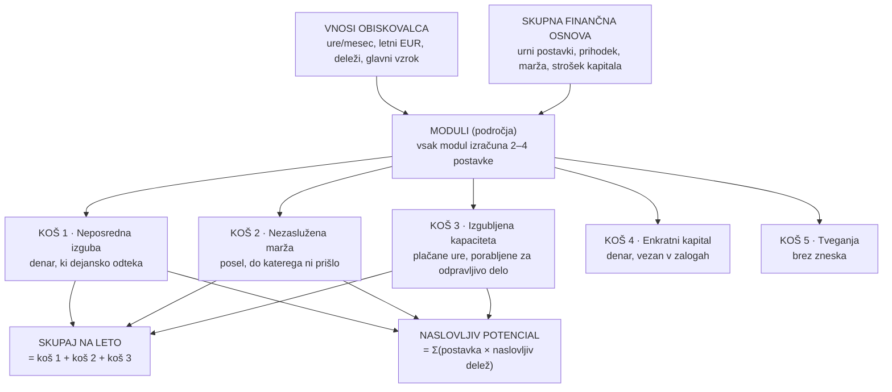

# Strankino poročilo: vsaka številka in pot do nje

Namen: **ena referenca, s katero znaš razložiti vsak znesek** na zaslonu rezultatov in v strankinem
PDF-ju — brez brskanja po kodi. Vse formule so preverjene proti `compute()` funkcijam v
`src/config/modules/` (stanje: avgust 2026, veja `urne-postavke-2026`).

Kratko vodilo za branje: poglavji 1–2 povesta, *kaj* stranka vidi; poglavja 3–8 razložijo *skupna
pravila*, ki veljajo za vse panoge; poglavje 9 ima *formule vseh postavk po panogah*; poglavje 10 pove,
česa poročilo namenoma ne trdi.

---

## 1. Celotna pot na eni strani



**Stavek za direktorja ob vsaki kartici:**

| Kartica | En stavek |
|---|---|
| SKUPAJ NA LETO | »Toliko vas letno stanejo izmerjena področja — sešteti so odtekli denar, nezasluženi posel in plačane ure, porabljene za odpravljivo delo.« |
| Neposredni letni stroški | »To je denar, ki ga lahko pokažete na kontu: izmet, penali, ekspresne nabave, odpisi.« |
| Nezaslužena letna marža | »To je posel, do katerega ni prišlo. Denar ni odtekel, zato ga prikažemo ločeno in ga ni mogoče ovreči skupaj z dokazljivim delom.« |
| Vrednost izgubljene kapacitete | »To NI prihranek pri plačah — zaposleni ostane. Je vrednost ur, ki bi jih lahko usmerili v delo, ki prinaša denar.« |
| Sprostljiv obratni kapital | »Enkraten učinek: denar, ki leži v presežni zalogi. Zato se z letnimi zneski nikoli ne sešteva.« |
| Ocenjen naslovljiv potencial | »Ne obljubljamo, da izgine vse. Najprej izmerimo celoten strošek, nato enkrat ocenimo, kolikšen del je po vašem lastnem odgovoru o glavnem vzroku realistično mogoče odpraviti. Vzrok v podatkih je naslovljiv v 75 %, okvara stroja v 15 %.« |

---

## 2. Kaj stranka vidi in kje to nastane

| Sekcija | Zaslon | PDF | Vir v kodi |
|---|:---:|:---:|---|
| SKUPAJ NA LETO (hero) | ✓ | ✓ | `src/components/Results/ResultsView.tsx:71`, PDF `src/lib/pdf.ts` (`drawHeroSection`) |
| Pokritost (»Izmerjeno 3 od 10 področij«) | ✓ | ✓ | `ResultsView.tsx` (`measuredCount`), `pdf.ts` (`coverage`) |
| Oznaka zanesljivosti | ✓ | ✓ | `src/lib/potential.ts` (`assessConfidence`) |
| Štiri kartice (izguba, marža, kapaciteta, kapital) | ✓ | ✓ | `src/components/Results/ResultsSummary.tsx` |
| Ocenjen naslovljiv potencial | ✓ | ✓ | `potential.ts` (`computeAddressablePotentialEUR`) |
| Graf po področjih | ✓ | ✓ | `BreakdownChart.tsx`, `pdf.ts` (`drawBreakdownChart`) |
| Razčlenitev po področjih (postavke z zneski) | ✓ | ✓ | `Breakdown.tsx`, `pdf.ts` (`drawResultsTable`) |
| »Prikaži izračun« (formula + strankine številke) | ✓ | **✗** | `MethodologyToggle.tsx`, besedila `content/methodology.ts` |
| Kje se izgublja kapaciteta (ure/mesec) | ✓ | ✓ | `ResultsView.tsx`, `pdf.ts` |
| Podatki in procesna tveganja (brez zneska) | ✓ | ✓ | `RiskCard.tsx`, `pdf.ts` (`drawRisksSection`) |
| Česa nismo izmerili | ✓ | ✓ | `ResultsView.tsx` (`unmeasuredModules`), `pdf.ts` (`drawUnmeasuredSection`) |
| 3 ukrepi ta teden | ✗ | ✓ | `content/actions/actions.ts`, `pdf.ts` (`drawActionPlanSection`) |
| +X strank brez nove zaposlitve (samo računovodstvo) | ✓ | ✓ | `src/lib/calculations.ts` (`calculateAccountingCapacity`) |

> Pomembno: **strankin PDF formul ne prikazuje** — formule z vstavljenimi strankinimi številkami so na
> zaslonu pod »Prikaži izračun«. Če stranka vpraša »od kod ta številka«, je odgovor tam ali v tem dokumentu.

---

## 3. Skupna finančna osnova (korak »Skupna finančna osnova«)

Štiri do šest številk, vprašanih **enkrat** — veljajo za vsa področja. Definicije in privzetki so v
`src/config/contexts/<panoga>.ts`.

**Kaj pomeni urna postavka:** polni strošek dela = bruto plača + prispevki delodajalca + regres,
malica, prevoz, deljeno s ~1.700 produktivnimi urami na leto. Ni neto plača in ni »z režijo«.
Izpeljava iz plač po poklicih (SURS): `docs/urne-postavke.md`.

**Trije načini odgovora na vsako vprašanje:**

| Način | Kaj vstopi v izračun | Oznaka za zanesljivost |
|---|---|---|
| Vpiše številko | točno ta številka | podatek (`estimated: false`) |
| Izbere razpon | **sredina razpona**; izračun teče še z min in max → rezultat postane razpon (`src/lib/range.ts`) | ocena (`estimated: true`) |
| »Vzemi povprečje panoge« ali pusti prazno | privzetek panoge (spodaj) | ocena (`estimated: true`) |

**Privzetki po panogah** (`fallbackEUR` / `fallback` v `src/config/contexts/*.ts`):

| Panoga | Operativna ura | Administrativna ura | Zaračunana ura | Marža | Strošek kapitala |
|---|---:|---:|---:|---:|---:|
| Proizvodnja | 23 EUR | 27 EUR | — | 25 % | — |
| Logistika | 22 EUR | 27 EUR | — | 25 % | — |
| Veleprodaja | 22 EUR | 27 EUR | — | 20 % | 6 % |
| Maloprodaja | 21 EUR | 27 EUR | — | 25 % | 6 % |
| Storitve | 32 EUR | 27 EUR | 55 EUR | 30 % | — |
| Računovodski servis | 26 EUR | 34 EUR | — | 30 % | — |
| Splošno | 23 EUR | 27 EUR | — | 25 % | 6 % |

Posebnosti:
- **Prihodek nima privzetka** (`fallback: 0`): brez odgovora postavke, vezane na prihodek, tiho
  izpadejo — prihodka si ne izmišljamo. To hkrati zniža zanesljivost na »nizko«
  (`potential.ts` — `isRevenueMissing`).
- »Operativna ura« se po panogah imenuje in vrednoti različno (proizvodna, voznikova, skladiščna,
  ura v poslovalnici, izvedbena, računovodska) — zato razponi niso enaki.
- Konstanta stroška kapitala tam, kjer ni vprašana: 6 % letno
  (`src/config/modules/shared.ts:27` — `RECEIVABLES_CAPITAL_COST`).

---

## 4. Pet košev in pravilo enega koša

Vsaka izračunana postavka gre v **natanko en koš** (`src/lib/moduleEngine.ts` — `aggregateBuckets`).
To strukturno prepreči dvojno štetje: ista ura ali isti evro ne more biti hkrati »izguba« in »kapaciteta«.

| Koš | Interno ime | Kaj meri | Se sešteva v SKUPAJ? |
|---|---|---|:---:|
| Neposredna izguba | `directLoss` | denar, ki je dejansko odtekel (konto ga pozna) | ✓ |
| Nezaslužena marža | `lostMargin` | posel, do katerega ni prišlo — stoji na predpostavki | ✓ |
| Izgubljena kapaciteta | `capacity` | plačane ure × urna postavka × 12 | ✓ |
| Enkratni kapital | `oneTimeCapital` | denar, vezan v zalogah/terjatvah — sprostljiv ENKRAT | ✗ (prikazan ločeno) |
| Tveganje | `risk` | kvalitativna ocena diagnostike | ✗ (brez zneska) |

Zakaj je marža ločena od izgube: odpoved naročila je denar, ki *ni nikoli prišel* — prvi ugovor
(»tega naročila morda tako ne bi dobili«) bi sicer podrl tudi dokazljivi del zneska
(komentar v `src/config/modules/proizvodnja.ts`, postavka »Izgubljena prispevna marža«).

Zakaj se kapital ne sešteva: je enkraten učinek; seštevanje z letnimi zneski bi bilo napačno in
prav to ločeni koši preprečujejo (`ResultsView.tsx:66–71`).

---

## 5. Pot do vsake številke na vrhu

### 5.1 SKUPAJ NA LETO

```
SKUPAJ = neposredna izguba + nezaslužena marža + izgubljena kapaciteta
```
- Vir: `ResultsView.tsx:71` (ista formula kot tekoča vsota med vnosom — `StepInputs.liveTotalEUR`).
- Meri **samo izbrana in izpolnjena področja** — od tod pripis »Izmerjeno 3 od 10«.
- Neizmerjeno področje prispeva natanko 0 EUR.

### 5.2 Kartice

| Kartica | Formula | Opomba |
|---|---|---|
| Neposredni letni stroški | Σ vseh postavk koša `directLoss` | |
| Nezaslužena letna marža | Σ koša `lostMargin` | kartica se skrije pod 100 EUR (`ResultsSummary.tsx:25` — `MIN_FIGURE_EUR`) |
| Vrednost izgubljene kapacitete | Σ koša `capacity`; pripis ur = Σ `hoursPerMonth` | ni prihranek pri plačah |
| Sprostljiv obratni kapital | Σ koša `oneTimeCapital` | skrije se pod 100 EUR; ne sešteva se |
| +X strank (samo računovodstvo) | Σ sproščenih ur / povprečne ure na stranko (vpraša jih `donosnostRs`; rezerva 8 h/mesec — `segments.ts:249`) | `calculations.ts` — `calculateAccountingCapacity` |

### 5.3 Ocenjen naslovljiv potencial

```
naslovljiv potencial = Σ čez letne postavke (znesek × naslovljiv delež)
```
- Vir: `potential.ts` (`computeAddressablePotentialEUR`).
- **Naslovljiv delež** pride iz odgovora »Kaj je glavni vzrok?« v vsakem področju (poglavje 6).
  To je **edini** koeficient, ki zmanjša izmerjeni strošek.
- Enkratni kapital je izpuščen — že sam JE potencial; množenje bi ga štelo dvakrat.

**Delovni zgled:** postavka 10.000 EUR/leto, vzrok »podatki« (0,75):
```
naslovljiv potencial = 10.000 × 0,75 = 7.500 EUR letno
```

**Kaj se je spremenilo (avgust 2026).** Doslej se je ta vsota množila še z »pasom izboljšave« iz
odgovora o sedanjem sistemu:
```
STARO: 10.000 × 0,75 × [0,25 … 0,40] = 1.875 – 3.000 EUR letno
```
Naslovljiv delež in pas sta merila isto stvar — koliko problema je sploh odpravljivega — zato je bil
isti problem zmanjšan dvakrat. Podjetju z ustreznim modulom PANTHEON je ostalo 600–1.500 EUR od
10.000 EUR izgube. Odgovor o sedanjem sistemu ostane vprašan, a je odslej prodajni signal
(»vrzel sistema«, poglavje 7) in v evre ne vstopa.

**Prikaz.** Potencial je **točka** z oznako zanesljivosti (»7.500 EUR/leto, zanesljivost: srednja«),
ne pas. Razpon se pokaže samo tam, kjer ga prinesejo izbrani pasovi skupnih predpostavk — urna
postavka, prihodek, marža (`lib/range.ts`). Zanesljivost je oznaka in nikoli drug odbitek od zneska.

---

## 6. Naslovljivi deleži (odgovor »Kaj je glavni vzrok?«)

`src/config/modules/addressableShare.ts:28`. Vsako stroškovno področje ponudi 4–6 vzrokov; vsak vzrok
spada v eno kategorijo:

| Kategorija | Delež | Primer vzroka |
|---|---:|---|
| Podatki, normativi, ročni prenosi (`data`) | **0,75** | »Prenos podatkov med prodajo, nabavo in proizvodnjo je ročen« |
| Planiranje, zaloge, vidnost (`planning`) | **0,65** | »Plan in kapacitete niso ažurni« |
| Ljudje: znanje, disciplina, kadrovska kapaciteta (`people`) | **0,45** | »Pomanjkanje usposabljanja« |
| Zunanji dejavniki (`external`) | **0,25** | »Dobavitelji so nezanesljivi« |
| Fizični vzroki (`physical`) | **0,15** | »Okvare strojev« |
| »Ne vemo« (`unknown`, privzeto) | **0,30** | — |

> KALIBRACIJA: deleži so začetne ocene iz specifikacije, ne empirija — preveriti po prvih ~50 vnosih
> (opomba v isti datoteki). Odkar so edini koeficient nad zneskom, gre napaka v njih naravnost v
> prikazano številko.

**Kategorija »Ljudje« je namenoma ozka.** Kadar ljudje grešijo, ker prepisujejo podatke, jih držijo v
glavi ali delajo v nepovezanih sistemih, vzrok ni človek — je podatek oziroma proces, in takšna težava
ob urejenem sistemu izgine. `people` velja samo za težave, ki bi ostale tudi ob dobro postavljenem
sistemu: pomanjkanje usposabljanja, slaba disciplina, premalo ljudi, odsotnosti. Zato so vzroki kot
»Odgovornosti niso jasne« in »Zalogo zavestno držimo kot varovalko« razvrščeni v `planning`, ne v
`people`; »Le ena oseba ve, kje kaj je« pa v `data`.

---

## 7. Vrzel sedanjega sistema (odgovor »Kako danes vodite …?«)

**Prodajni signal, ne množitelj.** Do avgusta 2026 je bil to »pas izboljšave« in je množil že
naslovljiv strošek (glej 5.3). Odslej ga hrani samo kvalifikacija: ocena ICP (`src/config/icp.ts`,
dimenzija »priložnost«) in prodajni playbook. V evre ne vstopa.

Vrzel visi neposredno na možnosti sistema v `src/config/contexts/<panoga>.ts` (`SystemOption.gap`) —
možnosti brez nje ni mogoče dodati. Vzorec je pri vseh panogah enak, imena možnosti so panožna:

| Sedanji sistem | Proizvodnja / Logistika / Veleprodaja / Maloprodaja / Storitve / Računovodstvo | Splošno |
|---|---|---|
| PANTHEON z ustreznim domenskim modulom | **0,08–0,20** | 0,08–0,18 |
| PANTHEON brez domenskega modula | **0,15–0,30** | 0,12–0,25 |
| Drug ERP / namenski sistem | **0,15–0,30** | 0,12–0,25 |
| Kombinacija ERP + Excel + papir | **0,25–0,40** | 0,20–0,35 |
| Večinoma Excel, papir, telefon | **0,25–0,40** | 0,20–0,35 |

Splošni segment ima ožje vrzeli namenoma: univerzalna vprašanja zajamejo strošek manj natančno
(`src/config/contexts/splosno.ts`, README »Splošno«).

---

## 8. Zanesljivost in način prikaza zneska

### 8.1 Kako se določi oznaka (`potential.ts` — `assessConfidence`)

Šteje se **tehtano po denarju področja** — neizpolnjeno polje pri področju z 80.000 EUR šteje bolj
kot pri področju s 500 EUR. Polje velja za izpolnjeno le, če je > 0 **in** različno od privzetka.

| Pogoj | Oznaka |
|---|---|
| Prihodek manjka, a ga izpolnjeno področje potrebuje | **nizka** (prebije vse) |
| Izpolnjeno ≤ 50 % (tehtano) ALI vse skupne predpostavke ocenjene | **nizka** |
| Nobena predpostavka ocenjena IN nič »Ne vem« IN izpolnjeno ≥ 80 % | **visoka** |
| Vse vmes | **srednja** |

»Ocenjena« predpostavka = prevzeto povprečje panoge ali izbran razpon — oboje šteje enako, ker gre v
izračun številka, ki je stranka ni izmerila.

### 8.2 Kako se znesek izpiše (`src/lib/format.ts:56` — `formatAmount`)

| Kdaj | Prikaz | Zgled |
|---|---|---|
| Katera skupna predpostavka je izbran razpon | **razpon** (izračun teče z min in max pasu) | »29.232 – 39.672 EUR« |
| Nizka zanesljivost, brez razpona | **»najmanj X«** | »najmanj 17.000 EUR« |
| Sicer | točen znesek | »37.000 EUR« |
| Zaokroženo na 0 | **»ni izmerjeno«** | — |

»Najmanj« je poštena spodnja meja: nedotaknjena polja vstopajo z 0, »Ne vem« pade na
konservativno vrednost — dejanski znesek je praviloma višji.

### 8.3 Tveganja iz diagnostike (`src/config/modules/shared.ts:93`)

Štiri vprašanja z ocenami 0–3 (+ »Nismo preverili«, ki se ne šteje). Dve tveganji: zanesljivost
podatkov (vprašanji 1–2) in procesna odpornost (vprašanji 3–4).

```
razmerje = vsota ocen / (3 × število odgovorjenih)
≤ 0,30 → nizko   ·   ≤ 0,60 → srednje   ·   > 0,60 → visoko   ·   brez odgovora → »ni ocenjeno«
```

---

## 9. Formule po panogah

Konvencije v tabelah:
- **Koši:** 💶 neposredna izguba · 📉 nezaslužena marža · ⏱ kapaciteta (vedno: ure/mesec × postavka × 12) · 🔒 enkratni kapital · ⚠ tveganje.
- »admin«, »oper«, »zaračunana« = urne postavke iz poglavja 3; »× 12« = mesečni vnos na leto.
- Diagnostika (⚠) je pri vseh panogah enaka: 4 vprašanja, brez zneska (poglavje 8.3) — v tabelah je izpuščena.
- Vzrok (»Kaj je glavni vzrok?«) v vsakem področju določi naslovljivi delež vseh njegovih postavk.
- »Sprostljiv delež« zaloge izbere stranka: do 5 % → 0,05 · 6–10 % → 0,08 · 11–20 % → 0,15 · nad 20 % → 0,22 · Ne vem → 0,05 (`shared.ts:120` — `REDUCIBLE_SHARES`).

Simbolne formule so tudi v `content/methodology.ts` (53 vnosov; na zaslonu pod »Prikaži izračun«).
Spodnje tabele so navzkrižno preverjene proti `compute()` — koda je resnica.

### 9.1 Proizvodnja (`src/config/modules/proizvodnja.ts`)

| Področje | Postavka | Koš | Formula |
|---|---|:---:|---|
| Plan, kapacitete in navodila | Zastoji in nadure v proizvodnji | ⏱ | (ure čakanja + nadure) × oper × 12 |
| | Ponovno planiranje in usklajevanje | ⏱ | ure × admin × 12 |
| Izmet, dodelave in kakovost | Izmet materiala | 💶 | letna poraba materiala × delež izmeta |
| | Reklamacije in vračila | 💶 | vpisan letni EUR |
| | Dodelave in ponovna izdelava | ⏱ | ure × oper × 12 |
| Zaloge in razpoložljivost | Odpisi in razvrednotenja zalog | 💶 | vpisan letni EUR |
| | Čakanje na manjkajoč material | ⏱ | ure × oper × 12 |
| | Sprostljiv obratni kapital | 🔒 | povprečna zaloga × sprostljiv delež |
| Delovni nalogi in podatki | Priprava in zaključevanje nalogov | ⏱ | ure × admin × 12 |
| | Prepisovanje podatkov med orodji | ⏱ | ure × admin × 12 |
| | Popravljanje napačnih podatkov | ⏱ | ure × admin × 12 |
| Roki in nujni stroški | Ekspresne nabave in dostave | 💶 | vpisan letni EUR |
| | Penali in popusti zaradi zamud | 💶 | vpisan letni EUR |
| | Izgubljena prispevna marža | 📉 | vpisan letni EUR (samo marža, ne cel posel) |
| | Obveščanje in usklajevanje s kupci | ⏱ | ure × admin × 12 |

**Preverjen zgled iz aplikacije** (vnosi iz testne seje; admin ura kot razpon 28–38 EUR → sredina 33):

```
Roki:      12.000 + 5.000 = 17.000 EUR (💶)   +   20.000 EUR (📉)
           obveščanje: 16 h × 33 EUR × 12 = 6.336 EUR (⏱)
Analitika: (20 + 10 + 15) h × 33 × 12 = 17.820 EUR (⏱)
Kadri:     (12 + 8 + 6) h × 33 × 12 = 10.296 EUR (⏱)
Kapaciteta skupaj: (16+45+26) = 87 h/mesec → razpon 87 × 28 × 12 = 29.232 … 87 × 38 × 12 = 39.672 EUR
```
Vse številke se ujemajo s tem, kar je aplikacija dejansko prikazala.

### 9.2 Logistika in transport (`src/config/modules/logistika.ts`)

| Področje | Postavka | Koš | Formula |
|---|---|:---:|---|
| Planiranje prevozov | Prazni in slabo izkoriščeni kilometri | 💶 | prazni km/mesec × strošek km × 12 |
| | Čakanje vozil in voznikov | ⏱ | ure × oper × 12 |
| | Razporejanje in usklajevanje voženj | ⏱ | ure × admin × 12 |
| Napačne dostave | Napačne in nepopolne dostave | 💶 | pošiljke/mesec × delež napak × strošek ene napake × 12 |
| | Poškodovano in izgubljeno blago | 💶 | vpisan letni EUR |
| | Reševanje reklamacij in iskanje pošiljk | ⏱ | ure × admin × 12 |
| Skladiščne operacije | Popisne razlike in odpisi | 💶 | vpisan letni EUR |
| | Iskanje in prekladanje blaga | ⏱ | ure × oper × 12 |
| | Sprostljiv obratni kapital v zalogi | 🔒 | vrednost zaloge × sprostljiv delež (0 za skladiščnike tujega blaga) |
| Prevozna dokumentacija | Priprava in zbiranje listin | ⏱ | ure × admin × 12 |
| | Prepisovanje podatkov med orodji | ⏱ | ure × admin × 12 |
| | Popravljanje napačnih podatkov | ⏱ | ure × admin × 12 |
| Zamude in stojnine | Nujni podnajemi in ekspresni prevozi | 💶 | vpisan letni EUR |
| | Penali, stojnine in popusti | 💶 | vpisan letni EUR (samo stojnine, ki jih plačate vi) |
| | Izgubljena prispevna marža | 📉 | vpisan letni EUR |
| | Obveščanje in usklajevanje s strankami | ⏱ | ure × admin × 12 |

### 9.3 Veleprodaja in distribucija (`src/config/modules/trgovina.ts`)

| Področje | Postavka | Koš | Formula |
|---|---|:---:|---|
| Naročila, ponudbe in cene | Ročni vnos naročil in ponudb | ⏱ | ure × admin × 12 |
| | Prepisovanje naročil med orodji | ⏱ | ure × admin × 12 |
| | Urejanje cenikov in popravljanje cen | ⏱ | ure × admin × 12 |
| | Izgubljena marža zaradi napačnih cen | 📉 | vpisan letni EUR (razlika v marži, ne cel račun) |
| Skladišče in komisioniranje | Iskanje blaga in nadure v skladišču | ⏱ | ure × skladiščna × 12 |
| | Ročno urejanje prevzemov | ⏱ | ure × skladiščna × 12 |
| | Inventure in preštevanja | ⏱ | **h/leto** × skladiščna (brez × 12) |
| Zaloge in izpad prodaje | Odpisi in nekurantna zaloga | 💶 | vpisan letni EUR |
| | Izgubljena marža zaradi manjkajočega blaga | 📉 | vpisan letni EUR |
| | Sprostljiv obratni kapital v zalogah | 🔒 | povprečna zaloga × sprostljiv delež |
| Odprema, vračila, reklamacije | Ponovne in nujne dostave | 💶 | vpisan letni EUR |
| | Dobropisi in odškodnine | 💶 | vpisan letni EUR |
| | Izguba vrednosti vrnjenega blaga | 💶 | vpisan letni EUR |
| | Reševanje reklamacij in vračil | ⏱ | ure × admin × 12 |
| Plačilni roki in terjatve | Strošek zamud pri plačilih | 💶 | (letni prihodki / 365) × dnevi prekoračitve NAD dogovorjenim rokom × strošek kapitala |
| | Opominjanje in izterjava | ⏱ | ure × admin × 12 |
| | Odpisane terjatve | 💶 | vpisan letni EUR |

Posebnost: šteje se samo prekoračitev NAD dogovorjenim rokom, ne celoten DSO — financiranje roka, ki
ste ga kupcu sami odobrili, je normalno poslovanje (README, »terjatve_trgovina«).

### 9.4 Maloprodaja (`src/config/modules/maloprodaja.ts`)

| Področje | Postavka | Koš | Formula |
|---|---|:---:|---|
| Prazne police | Nezaslužena marža praznih polic | 📉 | letni prihodek × delež izgubljene prodaje × marža × (1 − delež nadomeščenih nakupov) |
| | Ekspresne dobave in nujni prevozi | 💶 | vpisan letni EUR |
| | Iskanje in preverjanje zaloge po enotah | ⏱ | ure × ura v poslovalnici × 12 |
| Presežna zaloga in odpisi | Odpisi ter poteklo in poškodovano blago | 💶 | vpisan letni EUR |
| | Marža, izgubljena s prisilnimi znižanji | 📉 | vpisan letni EUR |
| | Strošek financiranja presežne zaloge | 💶 | presežna zaloga × strošek kapitala |
| | Sprostljiv obratni kapital v zalogah | 🔒 | povprečna zaloga × sprostljiv delež |
| Cene, akcije in marža | Marža pri prodaji po napačni ceni | 📉 | letna nabavna vrednost × delež izgube |
| | Neizkoriščeni rabati in bonusi | 💶 | vpisan letni EUR |
| | Vzdrževanje cenikov, akcij in oznak | ⏱ | ure × admin × 12 |
| Blagajna in zaključki | Dnevni zaključki blagajn | ⏱ | blagajne × minute zaključka na blagajno × odprti dnevi (255/305/355 po izbiri 5/6/7 dni v tednu) ÷ 60 × ura v poslovalnici |
| | Inventurni manko | 💶 | vpisan letni EUR (neznana izguba — ločeno od odpisov, kjer vzrok poznamo) |
| | Izvedba inventur | ⏱ | **h/leto** × ura v poslovalnici |
| Prevzem in prenosi | Prevzem blaga in vnos dokumentov | ⏱ | ure × ura v poslovalnici × 12 |
| | Usklajevanje dokumentov z dobavitelji | ⏱ | ure × admin × 12 |
| | Prenosi med poslovalnicami in skladiščem | ⏱ | ure × ura v poslovalnici × 12 |
| Spletna prodaja in kanali | Marža odpovedanih spletnih naročil | 📉 | vpisan letni EUR |
| | Neposredni stroški vračil | 💶 | vpisan letni EUR |
| | Usklajevanje artiklov, cen in zalog | ⏱ | ure × admin × 12 |
| | Ročna obdelava spletnih naročil | ⏱ | ure × ura v poslovalnici × 12 |

> Opomba: `content/methodology.ts` pri zaključkih blagajn še navaja fiksnih »305 odprtih dni« — koda
> od uvedbe vprašanja o odprtih dnevih računa z 255/305/355 (`maloprodaja.ts:49`). Velja koda.

### 9.5 Storitve in projekti (`src/config/modules/storitve.ts`)

Edina panoga z **zaračunano** urno postavko (cena, ne strošek).

| Področje | Postavka | Koš | Formula |
|---|---|:---:|---|
| Plan in zasedenost | Zastoji in nadure v ekipi | ⏱ | ure × izvedbena (strošek) × 12 |
| | Prerazporejanje in usklajevanje | ⏱ | ure × admin × 12 |
| Evidenca in zaračunavanje | Opravljene, a nezaračunane ure | 💶 | ure × **ZARAČUNANA** postavka × 12 — izgubljen prihodek, ne kapaciteta |
| | Dobropisi in popravki računov | 💶 | vpisan letni EUR |
| | Naknadna evidenca in potrjevanje ur | ⏱ | ure × admin × 12 |
| Obseg in dodelave | Delo nad dogovorjenim obsegom | ⏱ | ure × izvedbena × 12 |
| | Popravki po pripombah naročnika | ⏱ | ure × izvedbena × 12 |
| | Odpisi in popusti ob obračunu | 💶 | vpisan letni EUR |
| Projektna administracija | Ponudbe, poročila in vodenje | ⏱ | ure × admin × 12 |
| | Prepisovanje podatkov med orodji | ⏱ | ure × admin × 12 |
| | Popravljanje napačnih podatkov | ⏱ | ure × admin × 12 |
| Roki, plačila in vezan denar | Kazni in popusti zaradi zamud | 💶 | vpisan letni EUR |
| | Izgubljena prispevna marža | 📉 | vpisan letni EUR |
| | Obveščanje in usklajevanje z naročniki | ⏱ | ure × admin × 12 |
| | Sprostljiv kapital (nezaračunano delo + terjatve) | 🔒 | vezan znesek × ocenjen delež sprostitve |

Najostrejša meja: ista ura je bodisi nezaračunana (💶, po ceni) bodisi interna (⏱, po strošku) —
**nikoli oboje**. Varuje jo test v `storitve.test.ts`.

### 9.6 Računovodski servis (`src/config/modules/racunovodstvo.ts`)

Edina panoga **brez enkratnega kapitala** (servis ne drži zaloge). Dve urni postavki: računovodska
(referent) in vodstvena (podpis nosi odgovornost).

| Področje | Postavka | Koš | Formula |
|---|---|:---:|---|
| Zajem in vnos listin | Ročni vnos listin | ⏱ | listine/mesec × delež ročnih × minute/listino ÷ 60 × računovodska × 12 |
| | Prepisovanje med programi | ⏱ | ure × računovodska × 12 |
| | Skeniranje, razvrščanje, arhiviranje | ⏱ | ure × računovodska × 12 |
| Listine strank | Opominjanje in lovljenje listin | ⏱ | ure × računovodska × 12 |
| | Odgovarjanje na ponavljajoča se vprašanja | ⏱ | ure × **vodstvena** × 12 |
| Obračuni, roki in konice | Nadure ob obračunih | ⏱ | ure × računovodska × 12 |
| | Ročna priprava obračunov in poročil | ⏱ | ure × računovodska × 12 |
| | Zunanja pomoč v konicah | 💶 | vpisan letni EUR |
| | Globe in obresti zaradi ZAMUDE pri oddaji | 💶 | vpisan letni EUR |
| Napake in popravki | Popravljanje knjižb in usklajevanje | ⏱ | ure × računovodska × 12 |
| | Dodatne kontrole pred oddajo | ⏱ | ure × **vodstvena** × 12 |
| | Samoprijave in doplačila (napačna VSEBINA) | 💶 | vpisan letni EUR |
| | Dobropisi in odpisane storitve | 💶 | vpisan letni EUR |
| Donosnost strank | Neobračunano opravljeno delo | ⏱ | ure × računovodska (STROŠEK, ne cenik) × 12 |
| | Stranke pod lastno ceno | 📉 | število strank × mesečni primanjkljaj × 12 |

»**+X strank brez nove zaposlitve**« = Σ sproščenih ur / povprečne ure na stranko (vpraša
`donosnostRs`; rezerva 8 h/mesec, `segments.ts:249`).

### 9.7 Splošno (`src/config/modules/splosno.ts`)

Za podjetja, ki se ne najdejo v nobeni panogi. Ožje vrzeli sedanjega sistema (poglavje 7).

| Področje | Postavka | Koš | Formula |
|---|---|:---:|---|
| Ročno delo s podatki | Vnašanje in prepisovanje podatkov | ⏱ | ure × admin × 12 |
| | Popravljanje napačnih podatkov | ⏱ | ure × admin × 12 |
| | Ročna priprava poročil | ⏱ | ure × admin × 12 |
| Iskanje informacij | Zastoji zaradi manjkajočih informacij | ⏱ | ure × oper × 12 |
| | Iskanje informacij in dokumentov | ⏱ | ure × admin × 12 |
| | Statusna vprašanja in usklajevanje | ⏱ | ure × admin × 12 |
| Napake in ponovno delo | Popravljanje in ponavljanje dela | ⏱ | ure × oper × 12 |
| | Reklamacije, dobropisi in popusti | 💶 | vpisan letni EUR |
| | Izgubljena prispevna marža | 💶 * | vpisan letni EUR |
| Plačilni roki in terjatve | Strošek zamud pri plačilih | 💶 | (letni prihodki / 365) × dnevi prekoračitve × strošek kapitala |
| | Odpisane terjatve | 💶 | vpisan letni EUR |
| | Opominjanje in izterjava | ⏱ | ure × admin × 12 |
| Zaloge in vezan kapital | Odpisi in razvrednotenja zalog | 💶 | vpisan letni EUR |
| | Sprostljiv obratni kapital | 🔒 | povprečna zaloga × sprostljiv delež |

> \* **Opomba (neskladje v kodi):** v splošnem segmentu gre »Izgubljena prispevna marža« v koš
> neposredne izgube (`splosno.ts:341`), v vseh drugih panogah pa v ločen koš 📉. Posledica: pri
> splošnem segmentu se ta znesek prikaže pod »Neposredni letni stroški« namesto pod »Nezaslužena
> letna marža«. Zabeleženo za preverbo — dokler ni poenoteno, to razliko pri razlagi povej.

### 9.8 Horizontalna področja (`src/config/modules/horizontal.ts`) — ista definicija v več panogah

| Področje | Postavka | Koš | Formula |
|---|---|:---:|---|
| Analitika in poročanje | Ročna priprava rednih poročil | ⏱ | ure × admin × 12 |
| | Izredne analize in iskanje številk | ⏱ | ure × admin × 12 |
| | Združevanje podatkov iz več virov | ⏱ | ure × admin × 12 |
| Računovodstvo in finance | Ročno knjiženje in priprava dokumentov | ⏱ | ure × admin × 12 |
| | Usklajevanje evidenc | ⏱ | ure × admin × 12 |
| | Obračuni in poročanje državi | ⏱ | ure × admin × 12 |
| | Zamudne obresti, globe in popravki | 💶 | vpisan letni EUR |
| Kadri in plače | Evidence prisotnosti in delovnih ur | ⏱ | ure × admin × 12 |
| | Priprava in popravki obračuna plač | ⏱ | ure × admin × 12 |
| | Kadrovska administracija | ⏱ | ure × admin × 12 |
| | Stroški napačnih obračunov plač | 💶 | vpisan letni EUR |
| Dokumentacija in e-poslovanje | Potrjevanje dokumentov | ⏱ | ure × admin × 12 |
| | Iskanje in arhiviranje dokumentov | ⏱ | ure × admin × 12 |
| | Tiskanje, skeniranje, ročno pošiljanje | ⏱ | ure × admin × 12 |
| | Izgubljeni in prepozno potrjeni dokumenti | 💶 | vpisan letni EUR |
| Reklamacije in poprodajni servis | Garancijska popravila in servisni posegi | ⏱ | ure × **oper** × 12 |
| | Vodenje reklamacijskega postopka | ⏱ | ure × admin × 12 |
| | Nadomestni deli, zunanji servis, kulanca | 💶 | vpisan letni EUR |

Katera panoga dobi katero horizontalo, pove matrika v README (»Horizontalna področja«) — izključitve
preprečujejo dvojno štetje (npr. računovodski servis nima »Računovodstva in financ«, ker je to njegov
produkt).

**Modul E** (tehnična opozorila: SQL Server, Windows Server, ZIERDED) se pokaže samo obstoječim
uporabnikom PANTHEON in ne prispeva nobenega zneska — samo opozorila z datumi
(`src/config/modules/moduleE.ts`).

---

## 10. Česa poročilo namenoma NE trdi

1. **Neizmerjena področja ne prispevajo ničesar.** Prazno ali neizbrano področje = 0 EUR. Zato je
   skupni znesek spodnja meja, poročilo pa neizmerjena področja našteje po imenu (»Česa nismo izmerili«).
2. **»Ne vem« ni nič in ni izmišljena številka.** Pri urni postavki pade na sredino razpona, pri
   deležih na konservativno vrednost; hkrati prepreči oznako »visoka zanesljivost«.
3. **Potencial ni obljuba prihranka.** Je konservativen razpon: strošek × delež, ki ga po strankinem
   lastnem odgovoru povzročajo procesi/podatki × pas glede na sedanji sistem. PANTHEON z domenskim
   modulom dobi NAJNIŽJI pas (0,08–0,20) — obstoječi stranki ne obljubljamo čudežev.
4. **Podštevanje pred dvojnim štetjem.** Nekateri stroški se namenoma ne štejejo nikjer (npr. fizično
   ponovno komisioniranje napačne pošiljke v veleprodaji), meje med področji pa so zapisane v
   besedilih pomoči (»Ure, ki ste jih že vpisali v drugem področju, tu ne ponavljajte.«).
5. **Sproščene ure niso nižja plačna masa.** Zaposleni ostane; vrednotimo čas, ki se lahko usmeri
   v drugo delo.
6. **Tveganja nimajo zneska.** Kjer ni kalkulacije ali sledljivosti, natančnega zneska ni mogoče
   izračunati — navidezno natančna številka bi prav to težavo skrila.

---

## 11. Kje kaj preveriti v kodi

| Vprašanje | Datoteka |
|---|---|
| Formula posamezne postavke | `src/config/modules/<panoga>.ts` → `compute()` |
| Simbolna formula + razlaga (zaslon »Prikaži izračun«) | `content/methodology.ts` |
| Seštevanje košev, hero | `src/lib/moduleEngine.ts` (`aggregateBuckets`), `ResultsView.tsx:71` |
| Potencial | `src/lib/potential.ts:38` |
| Naslovljivi deleži | `src/config/modules/addressableShare.ts:28` |
| Pasovi izboljšave, urne postavke, privzetki panoge | `src/config/contexts/<panoga>.ts` |
| Zanesljivost | `src/lib/potential.ts` (`assessConfidence`) |
| Prikaz (razpon / najmanj / točka / ni izmerjeno) | `src/lib/format.ts:56` (`formatAmount`), `src/lib/range.ts` |
| Tveganja diagnostike | `src/config/modules/shared.ts:93` |
| Sprostljivi deleži zaloge | `src/config/modules/shared.ts:120` |
| Strankin PDF | `src/lib/pdf.ts` |
| Izpeljava urnih postavk (SURS) | `docs/urne-postavke.md` |
| Kateri moduli so v kateri panogi | `src/config/segments.ts` (`moduleIds`) |
